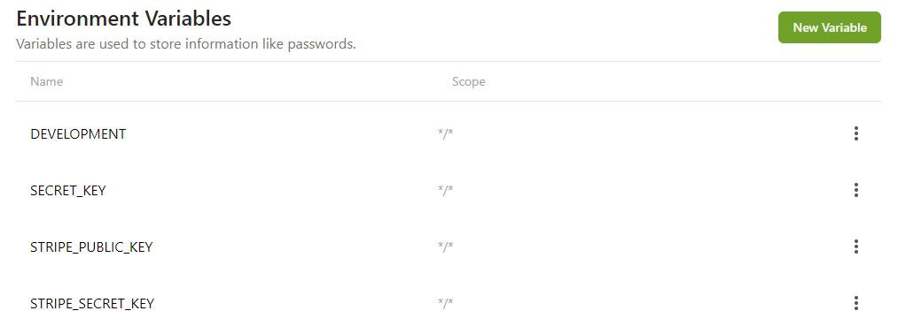
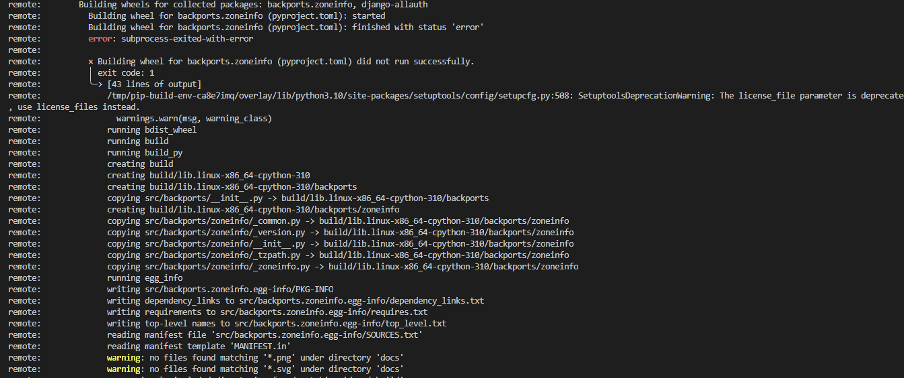
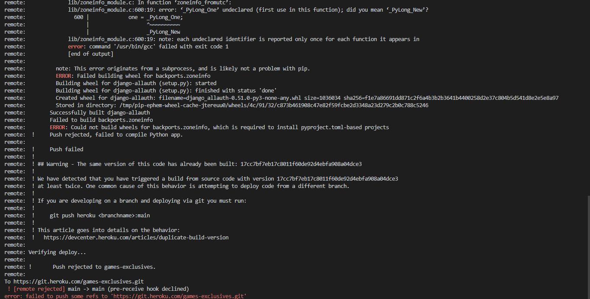

# **GAMES EXCLUSIVES - DEPLOYMENT**

This project was created using Gitpod, and stored in Github. I have used **Code Institute Full Template**.

The web applications itself is deployed to **Heroku** with static and media files stored in **Cloudinary**. 

## **GitHub & Workspace Setup**
1. Created a new GitHub repository page using the **Code Institute Template**
2. Opened new repository by clicking on **Gitpod** button
3. Setup your workspace and installed relevant applications and packages which were needed for deployment to **Heroku** 
4. Created three directories in the top level directory: media, storage and templates
5. All new apps added to my **settings.py** file in **INSTALLED_APPS** section
6. First migration and testing of the server - following steps are always followed during migration process: 
    - python3 manage.py makemigrations --dry-run
    - python3 manage.py makemigrations
    - python3 manage.py migrate --plan
    - python3 manage.py migrate

## **Stripe**
7. Registered for an account with Stripe
8. Selected **API keys** in the **Developers** section and copied my published and secret stripe keys.
9. Stored these in Gitpod > Settings > Variables > Environment Variables

## **Heroku**
10. Created new Heroku application named **games-exclusives**
11. Attached a database on Heroku by going to *Resources* tab and searched for **Heroku Postgres**
12. Installed the following in **Gitpod**:
    - dj_database_url
    - psycopg2-binary
    - pip3 install gunicorn
13. Updated **requirements.txt** file with *pip3 freeze > requirements.txt*
14. Run migrations and load data:
    - python3 manage.py migrate
    - python3 manage.py loaddata categories
    - python3 manage.py loaddata games
    - python3 manage.py createsuperuser
15. Updated **requirements.txt** file with *pip3 freeze > requirements.txt*
16. Logged in to **Heroku**: 
    - heroku login -i (email and API as password)
    - heroku config:set DISABLE_COLLECTSTATIC=1 -a, --app games-exclusives
    - heroku git:remote -a games-exclusives
    - git push heroku main

---> I have run into a zoneinfo error and had to contact **Tutor Support** for an assistance <---

17. As per **John's advice from Tutor Support** I had to create **runtime.txt** and roll **Heroku** stack from 22 to 20:

    - touch runtime.txt && echo "python-3.9.14" > runtime.txt
    - heroku stack:set heroku-20 -a games-exclusives
    - git add . && git commit -m "Add runtime.txt for heroku deployment"
    - git push origin main
    - git push heroku main

18. Removed secret key from settings and replaced with os.environ.get('SECRET_KEY', '')
19. Created a new SECRET_KEY with the help of [Django Secret Key Generator](https://miniwebtool.com/django-secret-key-generator/)
20. Added DATABASE_URL value and SECRET_KEY value to the **env.py** file and **Config Vars** in Heroku

## **Cloudinary**
21. Registered for an account with Cloudinary
22. On Dashboard, selected copy API Environment variable, copied my CLOUDINARY_URL
23. Added CLOUDINARY_URL to the **Reveal Config Vars in Heroku**, added to **env.py** file as well

24. Created **Procfile** in the main directory and added my gunicorn code
25. All changes added with add, commit, and push commands in Github and git push heroku main
26. Enabled Automatic Deploys in Heroku
27. Set DEBUG in **settings.py** to *DEBUG = 'DEVELOPMENT' in os.environ*