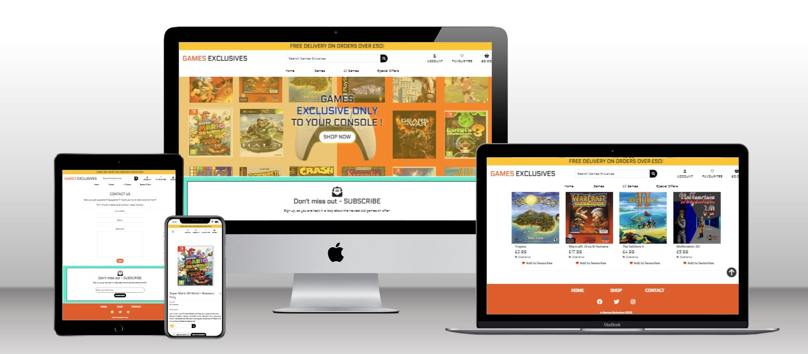
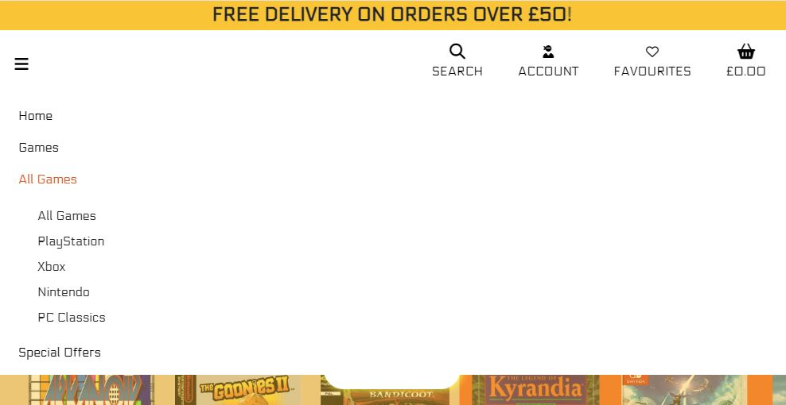
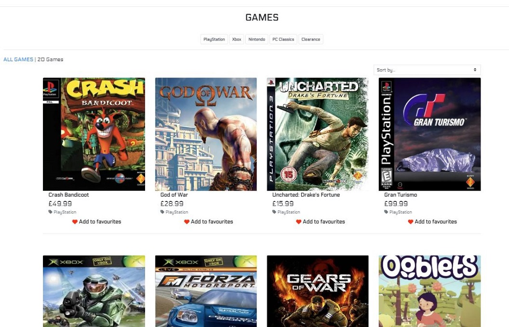
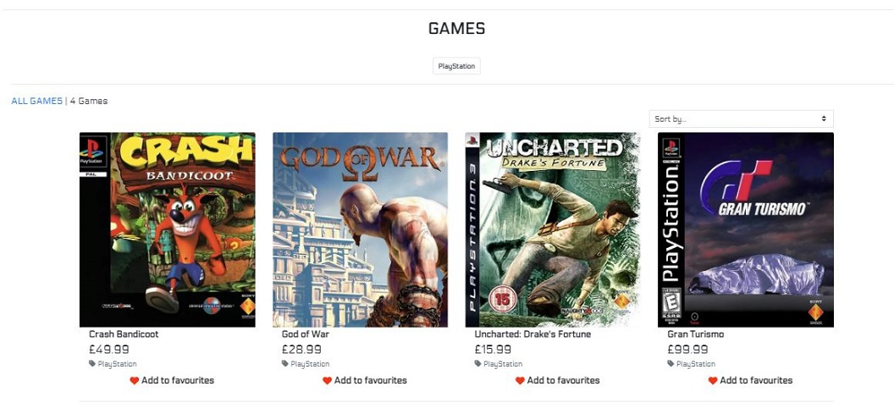
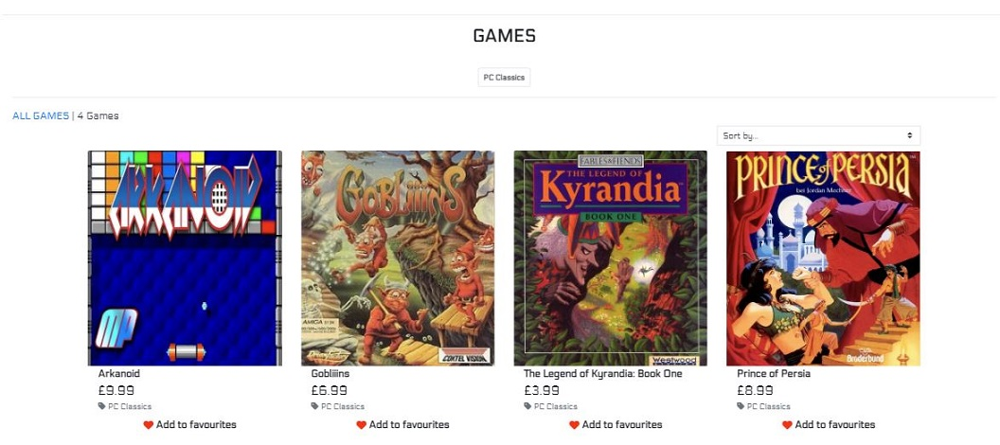
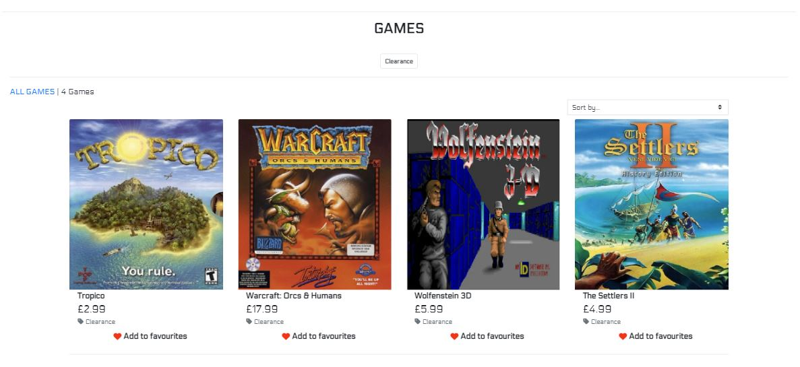
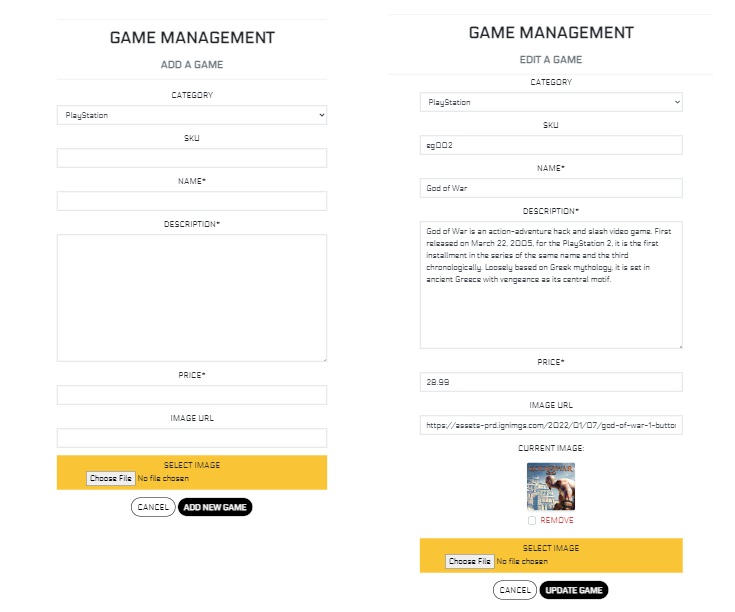

# **INTRODUCTION**

Games Exclusives is an e-commerce website built using Django, Python, HTML, CSS and JavaScript as part of the Code Institute Diploma in Full Stack Software Development.

Purpose of this e-commerce store is to sell game versions which are only exclusive to only one type of game console or were developed only for a PC. 

Live project can be found [**HERE**](https://games-exclusives.herokuapp.com/).

*Please press **Ctrl** in Windows or **Command** on Mac button and click for any links which you would like to open in a new tab when in the README.md file*

---
## **USER EXPERIENCE**

This website is based on a Business to Consumer (B2C) model. 

The target market for this store are game enthusiasts, collectors and fellow gamers with peculiar tastes in games. 

### **SHOPPER EXPECTATIONS**
- Ability to view and purchase games
- Easy to search and filter by category, name and price
- Can save a game into favourites
- Can access their account and view order history, favourite games and change personal information
- Can contact the owner via simple contact form
- Can leave, edit and delete their review

### **WEBSITE EXPECTATIONS**
- Has links to Facebook, Instagram and Twitter
- Privacy Policy link is included

### **WEB ADMIN EXPECTATIONS**
- Can update, add or remove products

---
## **USER STORIES**

### **AGILE PLANNING**
The development of this project was managed and implemented using GitHub project Kanban board and can be found [**HERE**](https://github.com/users/AMartins87/projects/7) *(press Ctrl in Windows or Command on Mac button while clicking on the link for it to open in a new tab)*.

User stories were labelled with **Must Have**, **Nice to have**, **Future development** and **CRUD**. 

Documentation like README, TESTING and DEPLOYMENT md files and preview of my business Facebook page were assigned a **Documentation** label.

#### **DATABASE SCHEMA**

- Database schema was created with [**LUCIDCHART APP**](Lucid.app)

    

---
## **FEATURES**
### **HOME PAGE**
- Delivery banner (on every page for constant reminder to a shopper)
- Shop name/logo with built in link to home page
- Top Navbar (on every page for ease of access)
    - Account
    - Favourites
    - Basket

- Main Navbar (on every page for ease of navigation)
    - Home 
    - All Games
    - Games
    - Special Offers

    

---
**TOP NAVBAR OF A USER WHO IS NOT LOGGED IN:** Register | Login
    

---
**TOP NAVBAR WHEN LOGGED IN AS A STANDARD USER:** My Profile | Logout

---
**TOP NAVBAR WHEN LOGGED IN AS AN ADMIN:** Admin Dashboard | Game Management | My Profile | Logout

---
**MAIN NAVBAR WITH SEARCH BANNER ON LARGE SCREENS**

---
**MAIN NAVBAR WITH COLLAPSIBLE MENU ICON FOR SCREENS WITH A WIDTH OF 991px OR LESS**

---
**MAIN NAVBAR WITH COLLAPSED MENU FOR SCREENS WITH A WIDTH OF 991px OR LESS**

---
**MAIN NAVBAR - GAMES DROPDOWN MENU ON LARGE SCREENS:** By Category | By Name | By Price 

---
**MAIN NAVBAR -  GAMES DROPDOWN MENU ON SCREENS WITH A WIDTH OF 991px OR LESS**

---
**MAIN NAVBAR- ALL GAMES DROPDOWN MENU ON LARGE SCREENS:** All Games | PlayStation | Xbox | Nintendo | PC Classics

---
**MAIN NAVBAR - ALL GAMES DROPDOWN MENU  ON SCREENS WITH A WIDTH OF 991px OR LESS**

---
**MAIN NAVBAR - SPECIAL OFFERS DROPDOWN MENU ON LARGE SCREENS:** Clearance 

---
**MAIN NAVBAR - SPECIAL OFFERS DROPDOWN MENU ON SCREENS WITH A WIDTH OF 991px OR LESS**

---
**HOME PAGE WITH A WELCOME TEXT AREA AND *SHOW NOW* BUTTON**

---
**MAILCHIMP - SUBSCRIPTION SECTION**

---
**FOOTER ON LARGE SCREENS**
- Social media links for Facebook, Instagram and a link for a contact page
- Policy Privacy link
- Copyright information

---
**FOOTER ON MEDIUM AND SMALL SCREENS WITH A WIDTH OF 767px OR LESS**

---
## **GAMES**
 
All **Games** pages display all listed games with preview of an image, their name, price, category and add to favourites button with heart icon

---
### **GAMES BY CATEGORY** 
#### **PLAYSTATION**

---
#### **XBOX**

---
#### **NINTENDO**

---
#### **PC CLASSICS**

---
#### **SPECIAL OFFERS: CLEARANCE**

---
### **ADD A GAME PAGE and EDIT A GAME PAGE**

---
### **MY PROFILE PAGE**
- Shows shopper's profile page with their delivery information and button to submit any changes made to their details
- Order history with linked order numbers which will take them to their order confirmation page
- Link to their favourites page

---
### **FAVOURITES PAGE**
- Shows shoppers' favourites games they saved while browsing the site. Page also contains a **Browse Games** button which will take them to a Games page

---
### **CONTACT PAGE**
- Shoppers can contact the site administrator by filling in the simple form on the screen where they are required to give their **name**, **email address**, and then type in their **message**.

---
## **WIREFRAMES**
All wireframes were created using Balsamiq

View wireframe images here

---
**HOME PAGE**

---
**GAMES PAGE**

---
**GAME DETAIL PAGE**

---
**EDIT GAME PAGE**

---
**ADD GAME PAGE**

---
**REGISTRATION PAGE**

---
**LOGIN PAGE**

---
**LOGOUT PAGE**

---
**PROFILE PAGE**

---
**FAVOURITES PAGE**

---
**CONTACT PAGE**

--- 
## **DESIGN**

### **FONT**
Electrolize font was used across the whole site and sourced from [**Google Fonts**](https://fonts.google.com/?query=electrolize).

### **COLOUR SCHEME**

The main background colour for the site is white, apart from the footer background which was set to #e85320.

Apart from the website logo and links in a footer, all text is black.

The footer text, links and icons are white.

---
# **MARKETING**

Facebook and Instagram are our main marketing platforms. 

I have created a [Facebook dummy page](https://www.facebook.com/profile.php?id=100086484473315) for Games Exclusives. This page contains description of our online store in ***About*** section, you can also find a link to our application, privacy policy and business description as video games store.

Instagram page was also created for purpose of this project [Instagram dummy page](https://www.instagram.com/gamesexclusives/)

---
# **SEARCH ENGINE OPTIMISATION**

To find the relevant keywords for this project I made searches on [Wordtracker](https://www.wordtracker.com/), [ahrefs](https://ahrefs.com/free-seo-tools) and [Game shop website](https://www.game.co.uk/), and selected keywords which would be important to customers, and added them in the meta tag section of my base.html 

---
# **TESTING**

Full testing document can be found [**HERE**](TESTING.md)

---
# **BUGS**

- I had issues with installing fixtures with both categories and games fixtures. After a review I found I had a typo in category model, and my games fixtures contained double quotation marks within double quotation marks in the games' description. Once I changed these to single quote marks all was loading correctly. 

- When deploying the application to Heroku, I had experienced *zoneinfo* error -> issue resolved with help of **Tutor Support** - documented in [**Deployment file**](DEPLOYMENT.md)

--- 
# **DEPLOYMENT**

This project was created using GitHub and Gitpod. Branches were created and after committing to the branch it was pushed up to the repository. 

Later, the project was deployed to Heroku, Heroku deployment was set to Enable Automatic Deploys, which meant that every time that the repository was pushed, Heroku was also updated.

Full deployment procedure can be found [**HERE**](DEPLOYMENT.md).

---
# **CREDITS**

## **CODE** 
- Code from walkthrough project of Boutique Ado by Code Institute was my main reference point when creating my own e-commerce website

- I used following sites as my main search point for this project: 
    - [**Django Docs**](https://docs.djangoproject.com/en/3.2/)
    - [**W3Schools**](https://www.w3schools.com/)
    - [**Bootstrap**](https://getbootstrap.com/docs/4.6/getting-started/introduction/)

- I searched for solutions to my many issues on the following sites and forums:
    - [**Stack Overflow**](https://stackoverflow.com/)
    - **Slack**

- I exhausted all the references above regarding bugs and issues, but **TUTOR SUPPORT** was there for me when I needed it most and for that I will be always thankful, especially to **Franciska** who helped me with my initial project setup after my 3 month study break,**John** who was a huge help during my deployment to Heroku and for help with my confirmation email function, **Oisin** who helped me with my checkout issue, **Alan** for guiding me through my issue/bug when deleting a review and **Sean**, **Alex**, **Scott** and **Ger**.

## **MEDIA**
- Background image was created in [Canva](https://www.canva.com/)

- Placeholder image for a missing game image was created in [Canva](https://www.canva.com/)

- Favicon - downloaded from [Flaticon](https://www.flaticon.com/free-icon/game-console_2949874)

- Product images were downloaded from various ecommerce websites and gaming blogs - I would have sourced my own images or sought copyright to use images not owned by me, would this have been a real e-commerce website

---
## **ACKNOWLEDGEMENTS**

I would like to thank my mentor [**Daisy McGirr**] (https://github.com/Daisy-McG), who has provided me with support in returning to this course after a break and has been instrumental in working through a few obstacles during this course.

My former mentor, **Maria Hynes**, was also a pivotal figure in my beginnings in coding.

---

*This project is for educational purposes only*