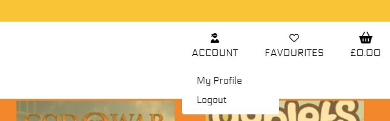

# **INTRODUCTION**

Games Exclusives is an e-commerce website built using Django, Python, HTML, CSS and JavaScript as part of the Code Institute Diploma in Full Stack Software Development.

Purpose of this e-commerce store is to sell game versions which are only exclusive to only one type of game console or were developed only for a PC. 

Live project can be found [here](https://games-exclusives.herokuapp.com/).

*Please press **Ctrl** in Windows or **Command** on Mac button and click for any links which you would like to open in a new tab when in the README.md file*

## **USER EXPERIENCE**

This website is based on a Business to Consumer (B2C) model. 

The target market for this store are game enthusiasts, collectors and fellow gamers with peculiar tastes in games. 

### **Shopper Expectations**
- Ability to view and purchase games
- Easy to search and filter by category, name and price
- Can save a game into favourites
- Can access their account and view order history, favourite games and change personal information
- Can contact the owner via simple contact form
- Can leave, edit and delete their review

### **Website Expectations**
- Has links to Facebook, Instagram and Twitter
- Privacy Policy link is included

***Web Admin Expectations***
- Can update, add or remove products

## **USER STORIES**

### **Agile planning**
The development of this project was managed and implemented using GitHub project Kanban board and can be found [**here**](https://github.com/users/AMartins87/projects/7).

User stories were labeled with **Must Have**, **Nice to have**, **Future development**. 

Documentation like README, TESTING md files and preview of my business Facebook page were assigned a **Documentation** label.

# **FEATURES**
## **Home Page**
- Delivery banner (on every page for constant reminder to a shopper)
- Shop name/logo with built in link to home page
- Top Navbar (on every page for ease of access)
    - Account
    - Favourites
    - Basket

- Main Navbar (on every page for ease of navigation)
    - Home 
    - All Games
    - Games
    - Special Offers

**Top navbar of a user who is not logged in:**
Register | Login

**Top navbar when logged in as a standard user:**
My Profile | Logout

**Top navbar when logged in as an admin:**
Admin Dashboard | Game Management | My Profile | Logout

**Main navbar present on every page**

**Main navbar with collapsible menu icon for screens with a width of 991px or less**

**Home page with a welcome text box and *SHOP NOW* button**

**Mailchimp - Subscription section**

    
**Footer**
- Social media links for Facebook, Instagram and a link for a contact page
- Policy Privacy link
- Copyright information

## All Games

**All Games** pages displays all listed games with preview of the item name, price and an image

# **Games** 
**Playstation**

**Xbox**

**Nintendo**

**PC Classics**

# **Special offers**
**Clearance**

## **Add a product page**

## **Update/remove product page**

## **Contact page**

Users can contact the site administrator by filling in the simple form on the screen where they are required to give their **name**, **email address**, **subject** and then type in their **message**

**Wireframes**
All wireframes were created using Balsamiq.

# **MARKETING**

Facebook and Instagram are our main marketing platforms. 

I have created a [Facebook dummy page](https://www.facebook.com/profile.php?id=100086484473315) for Games Exclusives. This page contains description of our online store in ***About*** section, you can also find a link to our application in there images of some of our games and has a business description as video games store.

# **SEARCH ENGINE OPTIMISATION**

To find the relevant keywords for this website I made the following searches on Google, Word Tracker...and selected keywords which would be important to the customers and added them in the meta tag. 

![screenshot]

- Keywords
- Long-tail keywords

# BUGS

issues with installing fixtures both with categories and games 
categories had a typo in model "model":"games.category",
games had several " " within " " in description of some games

# UNFIXED BUGS

# **DEPLOYMENT**

This project was created using GitHub and Gitpod. Branches were created and after committing to the branch it was pushed up to the repository. 

Later, the project was deployed to Heroku, Heroku deployment was set to Enable Automatic Deploys, which meant that every time that the repository was pushed, Heroku was also updated.

Full deployment procedure can be found [here](DEPLOYMENT.md).

# CREDITS

Favicon - https://www.flaticon.com/free-icon/game-console_2949874 

## ACKNOWLEDGEMENTS