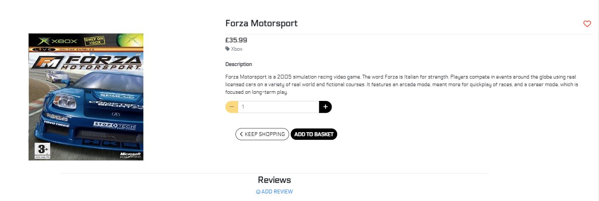
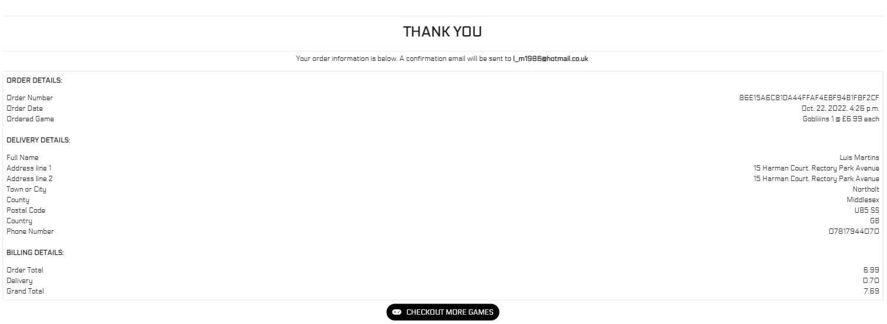
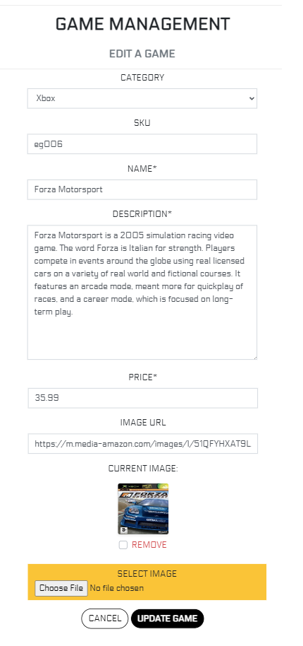

# **GAMES EXCLUSIVES - TESTING**

Testing.md document records all reports from validators and gives a summary of manual testing which got carried out on several devices.

## **TABLE OF CONTENTS**
1. [Testing User Stories](#Testing-User-Stories)
2. [Manual Testing](#Manual-Testing)
3. [Automated Testing](#Automated-Testing) 
4. [User Testing](#User-Testing)

---
## [**USER STORIES**](#Testing-User-Stories)
### **SITE USER / SHOPPER**

- As a **New User/Shopper** I can easily register on this website so that I can place an order quickly and easily
    - I can find a registration link in the main nav bar
    
    - I am also prompted to register if I try to access favourites section or add a game to favourites, and try to *Add Review*
    
    - I am also reminded of logging in or creating an account when on checkout page
    

- As a **Registered Shopper** I can easily login/logout of my account so that I can access my personal details, view my orders history and view my favourite games
    - Main navbar in the header contains link to account **Login** 
    
    - This changes to **Logout** when I log in
    

- As a **Shopper** I will receive an email to verify my newly created account so that I can confirm my account registration was genuine and successful
    - On registering for an account, a verification email is sent to user's registered email so they can verify their account and log in
    

- As a **Registered Shopper** I can leave a game review so that I can share my opinion on said game
    
    - Any registered user can leave a review via a form on game info page which will ask them to add title and text of their review
    
    - Submitted review will show title, body, username and date
    
    - Once I click **Add Game Review** button, review is added to the game detail page and a notification toast pops up in the top right corner announcing I added my review
    

- As a **Registered Shopper** I can edit my game review that I can share a correct view on a game
    - As a author of the review I can edit it via the link shown below the review's title
    
    - Once I click on the *Edit* link, I am taken to a **Edit Review** page
    
    - The *Back to game* button returns me back to the game page, the *Update Game Review* button updates the review and notification toast pops up in the top right corner announcing I updated my review
     

- As a **Registered Shopper** I can delete my game review when it's no longer applicable
    - As a author of the review I can delete it via the link shown below the review's title
    - Once I click on the *Delete* link, a modal pops up asking if I am sure I want to delete said review
     
    - The *Cancel* button returns me back to the review, the *delete* button deletes the review and notification toast pops up in the top right corner announcing I deleted my review
    
    

- As a **Shopper** I can type in search bar name of a product or related keyword so that I can be taken to a searched for product or list of similar ones
    - There is a search bar in the header which allows users to search for games based on keywords in the description or name fields
    
    - When a search query is submitted, the user is brought to a filtered games page. Here they can see the games which align with their search, as well as an indicator of how many items where found relating to the search query
    

- As a **Shopper** I can **browse through all listed products so that I can make a purchase
    - I can see a list of product cards with listed games, showing their image, name, price and *Add to favourites* link
    

- As a **Shopper** I can click on a product so that I can view all listed details about it
    - Once I click on a desired product, I am taken to product info page where I can see the image, title, price, category and description
    
    - I can also add the game to my favourites by clicking on the heart icon next to the title

- As a Shopper I want to be able to read games review so that I can make informed decision before making a purchase
    - If I want to read reviews about a desired game, I have to click on the game card to get into its game detail page and see if there are any reviews in the **Review** section at the bottom of the page
    

- As a Shopper I can add a product in to the shopping basket so that I can buy this product
  - The link to the shopping basket page advises the checkout is secure, and the payment information input is set to ensure the user's information is correct and valid before purchasing.

- As a Shopper I can add or remove products in the shopping basket so that I can buy the wanted amount if I change my mind
    - There is a quantity increment and decrement button with an update button that allows the user to increase or decrease the number of the specific item they wish to purchase

- As a Shopper I can checkout my shopping bag so that I can complete my purchase and see a summary of my order
    - The shopping basket icon in the header gives an up-to-date counter of the current shopping basket total. In addition, each item added to the shopping basket activates a pop-up which details your current shopping basket summary, prices, total cost and shipping. It also advises the user how much more they need to spend to qualify for free shipping.
    - There is a shopping basket page which allows the user to view all games currently selected, quantity, and the total cost with of shipping. Here the user can also update and delete items from the shopping basket if required.

- As a **Shopper**, I can view the order confirmation page after I made a payment so that I know my order and payment have gone through successfully.
    - Once I clicked on **Complete Order** I was taken to checkout success page with my order summary of what I ordered, my billing information, my delivery information and how much I spent in total
    
    - A success toast pops up in the top right corner announcing I have placed my order successfully and I will receive an email confirming this
    

- As a **Shopper** I want to be able to receive an order confirmation email after I finalise checkout so that I can verify that I placed my order successfully
    - Once I clicked on **Complete Order** button and was taken to order confirmation page, I have received an email confirming my order with all the details
    

- As a Registered Shopper I can add or remove a game to my favourites so that I can either purchase it again or go back to it at later stage without prolonged searches

- As a Shopper I can subscribe with my email address so that I will get informed about promotions, sales and new games coming in

- As a Shopper I want to be able to sort all products by name, price and product category so that I can see them in desired order to ease site navigation and for faster shopping experience
    - There is a 'sort-by' selector box on the games page which allows the user to sort the games by category, name and price in ascending or descending order

- As a Shopper, I can view the order confirmation page after I made a payment so that I know my order and payment have gone through successfully

- As a Shopper, I can add my card details during checkout process so that I can pay for the products in my shopping basket
- The checkout screen uses the Stripe payment system for safe and secure payment of purchases

- As a Shopper I can register my profile so that I can add or change delivery address and view my current and previous orders
    - On registration of a new account, a personal profile is automatically rendered. Here the user can view their order history and pet profiles

- As a Shopper I want to be able to contact the site admin so that I can ask a question, make a suggestion or send a compliment

- As a Site User, I want to be able to sort a specific game category so that I can find the best-priced or best-rated game in a specific category, or sort the games in that category by name.
    - There are navigation links and filter buttons that allow the user to view all games of a certain category or group of categories.

***
### **SHOP OWNER / ADMINISTRATOR** 
- As a **Site Admin** I can change product details so that I can reflect any changes like a new description or price change
    - If logged in as super user, I can access the **Game Management** section via a link which is in the **Account** dropdown in main nav bar
    - Once clicked, the super user will be taken to a **Game Management - Add a game** page, where they have to select a category, and fill in the game details like game name, description and price. Optional fields are SKU number, image URL and uploading game image

- As a **Site Admin** I can add a new product so that I can add variety to my e-store
    - I can do this by selecting a game I want to edit, entering the game's info page and click on the **Edit** link which is placed underneath the category tag and is only visible to super users
    
    - I can also view this link on the main games page underneath each game
    
    - Once clicked, the super user will be taken to a **Game Management - Edit a game** page, where they can make planned change like update prices, description, add or remove image, and add or change a SKU number
    

- As a **Site Admin** I want to be able to delete a game so that I can remove it if it's no longer available
    - I can do this by selecting a game I want to delete, entering the game's info page and click on the **Delete** link which is placed underneath the category tag and is only visible to super users
    
***

[Back to top](#)

## [**MANUAL TESTING**](#Manual-Testing)

I have tested the site functionality and created a couple of normal user accounts during this process.

### **1. Menu/navbar links**
### **Purpose: Test if all present link take users to the correct pages**

These were tested by clicking on each navigation link from each page.
All links are directed to the correct pages as expected.

---

### **2. Registration & Login**
### **Purpose:Test if users can register to the website**

1. Enter [Games Exclusives e-commerce site](https://games_exclusives.herokuapp.com/) and click on [**Register** link](https://games_exclusives.herokuapp.com/users/register/) in top navbar

    

2. Write in the username, first and last name, email, password, and again password to confirm. Then click *Register* button

    

3. Once the user clicks on the register button, they will be taken **Login page** to log in with their new login details

4. User is successfully logged and redirected to home page

---

### **3. Logout**
### **Purpose: Test if users can logout of their account**

1. log in to [Games Exlusives](https://games_exclusives.herokuapp.com/)
2. Top navbar links change from Login / Register to **Logout** and **My Profile** link will appear
3. Click on **Logout**

    

4. User will be asked if they are sure they want to loggout and if clicked yes, user is successfully logged out and redirected to the home page

---

### **4. Adding game into shopping basket**
### **Purpose: Test if users can add a game into a shopping basket**

---

### **5. Checkout**
### **Purpose: Test if users can checkout**

---

### **6. Ameding quantities and removing itesm from a shopping basket**
### **Purpose: Test if users can change quantities of games in their basket and/or remove them**

---

### **7. Add to favourites testing**
### **Purpose: Test if favourite button works**

1. If shopers are not logged in, the favourite icon won't show on the screen

    

2. If shoppers are logged in, the favourite icon will show on the screen

    

3. By clicking on the **Favourite** icon, the game will save in shoppers account and they will be able to view it when clicking on **My Account** link in top nav bar

    

---

### **8. Edit/Update listed game**
### **Purpose: Test if listed games can be updated with new price, information or with a new image**

1. To be able to edit/update a game I have to be logged in as an administrator

---

### **9. Delete listed game**
### **Purpose: Test if a game can be deleted**

1. To be able to delete a game, I have to be logged in as an administrator
2. Once logged in, I have to click on **My Account** in top right corner and then game management link 

    
 
---

### **10. Footer - social media links**
### **Purpose: Test if all social media links take users to their respective links and open in new windows**

These were tested by clicking on each social media icon.
All of these opened respective social media sites in new windows as expected.

### **11. Footer - contact page link**
### **Purpose: Test if users can successfully contact the site administrator via the Contact page link**

1. Click on [**Contact Us**](https://games_exclusives.herokuapp.com/contact/) link within a footer
2. The page opened, I was able to fill it in and submitted. All site users, both registered and not, can use the contact form by filling all the required details - Name, email, reason of their contact and then the message text
    
    
    
    

3. Confirmation of its succesfull submission was shown on screen and confirmation email received.

---

All of these tests were performed on desktop PC, Dell laptop, and iPhone8, iPhone 8, iPhone 12, and iPad Pro and worked as planned. The app was responsive and very easy to navigate.

### SUMMARY OF ALL TESTS 
- Menu links tested
- Login and registration
- Browsing and clicking through of listed games
- Added a new game with and without image
- Edited an existing listed game
- Deleted a game listing
- Left a rating/review on a game
- Added a game to favourites
- Tested all footer social media links
- Tested contact link and filled in the contact form

---

# [**AUTOMATED TESTING - CODE VALIDATORS**](#Automated-Testing)

## **HTML**
- No errors were returned when passing through the official W3C validator

    

## **CSS**
- No errors were found when passing through the official Jigsaw validator

    

## **PEP8**
- All python code was checked via [PEP8](http://pep8online.com/) with no errors reported.)
    
  ### **Games app**
  #### **admin.py**

  

  #### **forms.py**

  

  #### **models.py**

  

  #### **urls.py**

  

  #### **views.py**

  

# Accessibility

I checked that the chosen colors and fonts are easy to read. All pages have passed through the Lighthouse reporting tool in Chrome developer tools on both mobile and desktop.

- [Contrast checker - body text](media/testing/validators/)
- [Contrast checker - links](media/testing/validators/)
- [Contrast checker - hover selector](media/testing/validators/)

---

## **Lighthouse Testing**

  ### **Desktop**
  
  
  
  
  
  
  
  

  ### **Mobile**

  